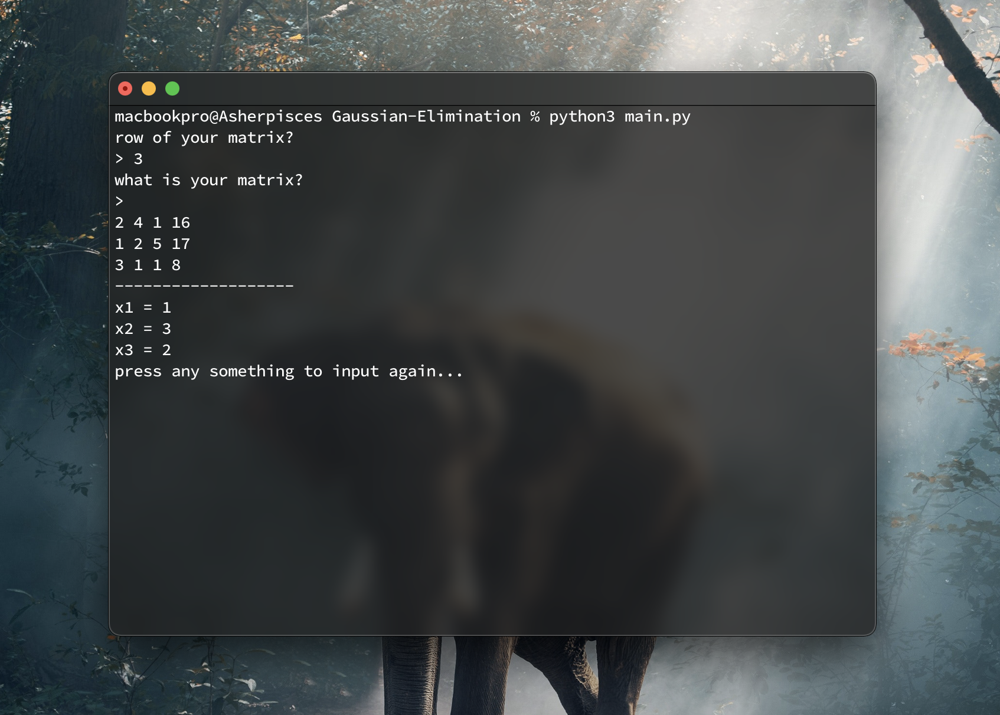
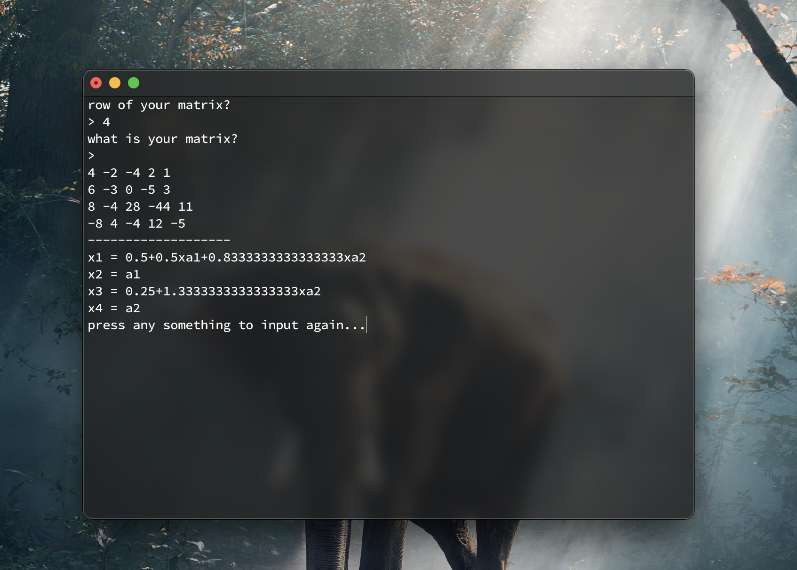
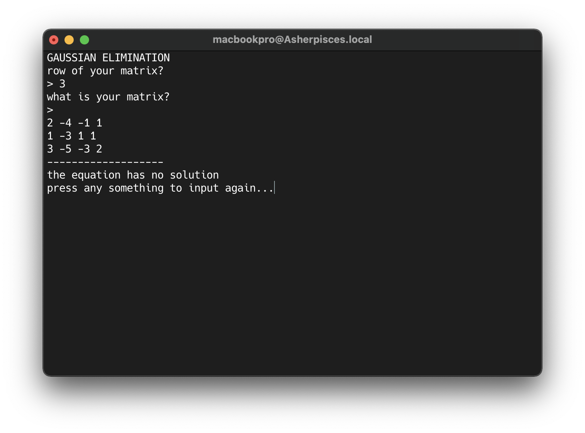

# Gaussian Elimination CLI

- Made with Python
- Support better for MacOS/Linux Environment
- This is the Project of **Toán Ứng Dụng và Thống Kê** Subject
- The application helps us solve the linear equation
- Scores: ? :)

# Requirements

- Install [Python](https://www.python.org/downloads/)

# Deployment

- Terminal Window

```
% git clone https://github.com/Asherpisces/Gaussian-Elimination.git
```

```
% cd Gaussian-Elimination
```

```
% python3 main.py
```

# Overview

- Example 1
  
- Example 2
  
- Example 3
  

Auther: Nguyễn Thái Hiệp
